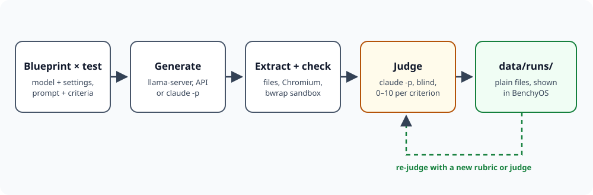

# Benchy

Benchy benchmarks local and remote language models against your own prompts. Every result is stored as plain files and checked automatically. An independent Claude Code judge then scores it per criterion. BenchyOS, a desktop-style web UI, shows outputs, llama.cpp settings, run metadata and verdicts, and exports a read-only copy for sharing.



*Generating and judging are decoupled: a new rubric or judge model re-scores stored results without calling the model again.*

## Concepts

| Term | What it is | Where it lives |
|---|---|---|
| **Blueprint** | The thing under test: a model plus every setting that matters (llama-server flags, sampling, effort, system prompt). Versioned by a hash of its settings. | `library/blueprints/<id>.yaml` |
| **Bench test** | A prompt, the files you expect back, automated checks and the judge criteria. | `library/tests/<id>/test.yaml` + `prompt.md` |
| **Suite** | A named set of tests with default repetitions. | `library/suites/<id>.yaml` |
| **Run** | Blueprints × tests × repetitions, with snapshots of everything used. | `data/runs/<run-id>/` |
| **Attempt** | One blueprint × test × repetition: response, artifacts, evidence, checks, verdicts, your own rating. | `data/runs/<run-id>/<blueprint>/<test>/<rep>/` |

**Blueprint kinds**

- `llama-cpp` — Benchy starts llama-server on **this** host in router mode with a generated preset, one model at a time.
- `openai-compatible` — any `/chat/completions` API with a key from `.env`: OpenRouter, Ollama Cloud, OpenAI, vLLM, LM Studio.
- `claude-code` — `claude -p` as the subject, in `chat` mode (one answer, no tools) or `agentic` mode (writes files in a sandbox).
- `dry-run` — canned responses, including deliberately broken ones. No network, no model.

## Requirements

Debian-based Linux (Pop!_OS, Ubuntu, Debian, or WSL on Windows) with:

- **Node 24+** and **pnpm**
- **Claude Code**, logged in (`claude` on `PATH`) — the judge uses your subscription
- **bubblewrap** (`sudo apt install bubblewrap`) — sandbox for generated programs
- Optional: **llama.cpp** for local models, **openscad** for `.scad` 3D models

## Get started

1. Install dependencies and the headless browser the checks use:

   ```bash
   pnpm install
   pnpm exec playwright install chromium
   pnpm build
   ```

2. Configure this host. Copy the example and set the llama-server binary and models directory:

   ```bash
   cp benchy.local.yaml.example benchy.local.yaml
   cp .env.example .env        # only for API blueprints
   ```

3. Check the host:

   ```bash
   ./bin/benchy doctor --probe
   ```

   `--probe` makes one tiny `claude -p` call to prove the login works.

4. Run the smoke suite without any model or cost:

   ```bash
   ./bin/benchy run -s smoke -b dry-run --judge dry-run
   ```

5. Open BenchyOS:

   ```bash
   ./bin/benchy serve        # http://127.0.0.1:8787
   ```

> [!IMPORTANT]
> Keep `server.bind` at `127.0.0.1`. The API starts processes (llama-server, `claude -p`, sandboxed programs) and has no authentication.

## Run local models

Benchy only ever controls llama-server on the machine it runs on. On **hermine** it runs inside WSL and drives the Windows CUDA build. On **Gertrude** it drives the native Vulkan build.

1. Import your router preset once. Every `[section]` becomes a blueprint:

   ```bash
   ./bin/benchy import-preset ~/tooling/llama.cpp/presets/models.ini --strip-models-dir
   ```

2. Make variants in the Blueprints app with **Derive**. A derived blueprint uses `extends` and only lists what differs, for example `reasoning-effort: high` or `cache-type-k: q4_0`.

3. Start a run from **New run** or the CLI:

   ```bash
   ./bin/benchy run -s html-classics -b Qwen3.6-27B -b gemma-4-31B
   ```

**How Benchy handles llama-server:**

- **Own instance on port 8099.** It writes a preset with one section per blueprint and runs `llama-server --models-preset … --models-max 1`. The router loads each model when its turn comes. Your own router on 8081 is never touched.
- **Refuses a busy GPU.** If any other llama-server runs, the preflight reports it and the run does not start.
- **Stops only its own process, by PID.** Under WSL that means `taskkill /PID`, never by image name.
- **Records the real settings.** Per blueprint it stores the preset section, the exact launch argv from the router, `/props`, the build, the GPU and the timings (prompt and generation t/s, draft acceptance).

Relative model paths resolve against `llama.models_dir`, so one blueprint works on both hosts.

## Judging

The judge is `claude -p` with `claude-opus-5-5` at effort `xhigh` by default. Change the default in `benchy.config.yaml`, or per run with `--judge-model` and `--judge-effort`.

- **Isolated from your setup.** `--safe-mode` (static) or `--restricted` (interactive) with `--strict-mcp-config`: your CLAUDE.md, hooks, skills and MCP servers do not reach the judge.
- **Blind.** It works in a neutral temp directory: task, criteria, submission, screenshots and check logs. Nothing names the model.
- **Structured.** `--json-schema` forces a score, rationale and evidence per criterion. Benchy computes the 0–100 score from the weights. A `required` criterion below 5/10 fails the attempt's gate.
- **Two depths per test.** `static` reads code, screenshots and logs. `interactive` also drives the page with Playwright MCP and may run programs with sandboxed Bash. Interactive is more thorough and much slower.

Re-judge anything without regenerating:

```bash
./bin/benchy judge <run-id>                       # current rubric, default judge
./bin/benchy judge <run-id> --judge-model haiku   # cheap sanity pass
./bin/benchy criteria 09-violin-3d --write        # let Claude draft a rubric
```

Rate attempts yourself in the attempt viewer's **Human** tab. The leaderboard can rank by judge, human or a blend. The Judge app shows where you and the judge disagree.

## Commands

| Command | Does |
|---|---|
| `benchy serve` | BenchyOS and API on localhost |
| `benchy run -s <suite> -b <blueprint>…` | Run, with preflight; hands off to a running server |
| `benchy judge <run\|attempt>…` | (Re-)judge stored attempts |
| `benchy resume <run> [--retry-failed]` | Continue an interrupted run; optionally regenerate failed attempts |
| `benchy recheck <run\|attempt>…` | Re-run the automated checks (fresh screenshots and logs) |
| `benchy list [blueprints\|tests\|suites\|runs\|checks]` | Show the library and library errors |
| `benchy criteria <test> [--write]` | Draft judge criteria with Claude |
| `benchy import-preset <models.ini> [--strip-models-dir]` | Blueprints from a llama-server router preset; relative model paths make them portable |
| `benchy import-legacy runs/ --preset <ini>` | Import llm-check results |
| `benchy export <dir>` | Read-only static site for sharing |
| `benchy doctor [--probe]` | Check Node, Chromium, bwrap, claude, llama-server, GPU, keys |

## Share results

```bash
./bin/benchy export ../benchy-site
python3 -m http.server --directory ../benchy-site 8000
```

The export is the same BenchyOS in read-only mode, plus JSON snapshots and every linked file. Host it on any static web server. It does not open from `file://`, because browsers block ES modules there.

## Checks

| Check | Runs on | What it does |
|---|---|---|
| `output.files` | every attempt | Declared files present, truncation, empty files |
| `html.parse` | HTML | parse5: doctype, structure, parse errors, duplicate ids |
| `html.render` | HTML | Chromium, network blocked: page/console errors, blocked requests, timed screenshots, scripted interactions |
| `svg.render` | SVG | Rendered screenshot, XML errors |
| `model3d.render` | OBJ, STL, glTF, PLY, OpenSCAD | three.js, four views, geometry stats |
| `program.run` | Python, Bash, JS/TS, C/C++, Rust, Go … | bubblewrap without network, cases with args, stdin and exact expectations |
| `json.parse`, `text.stats` | JSON, prose | Validity; words, headings, length limits |

The status per attempt is one of `ok`, `warnings`, `broken` or `failed` (nothing extracted or generation failed).

## Develop

```bash
pnpm dev        # API on :8787 + Vite on :5173 with hot reload
pnpm check      # svelte-check, 0 errors and 0 warnings
pnpm test       # Vitest, including the dry-run pipeline with Chromium
pnpm lint       # Prettier + ESLint
```

Contributor and agent conventions are in [AGENTS.md](AGENTS.md).
